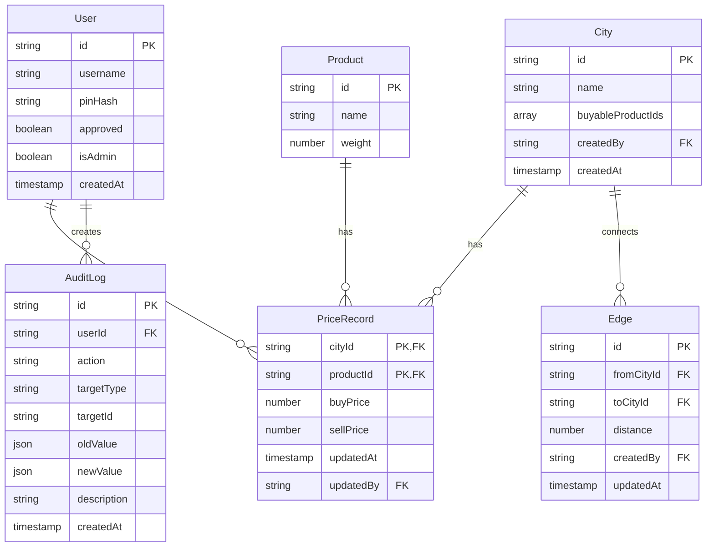

# 数据模型设计

## 核心实体关系

## 详细字段说明

### User (用户表)
- `id`: 用户唯一标识，使用用户名作为主键
- `username`: 用户名，2-16字符，中英文数字
- `pinHash`: PIN码哈希值，使用bcrypt加密存储
- `approved`: 是否已被管理员审批
- `isAdmin`: 是否为管理员
- `failedAttempts`: PIN码输入失败次数，默认0
- `lockedUntil`: 账户锁定到期时间，3次失败后锁定5分钟
- `lastLoginAt`: 最后登录时间
- `createdAt`: 账户创建时间

### City (城市表)  
- `id`: 城市ID，格式如 "city_001"
- `name`: 城市名称，中文古风名称
- `buyableProductIds`: 该城市可购买的3种商品ID数组
- `createdBy`: 创建该城市的管理员ID
- `createdAt`: 城市创建时间

### Product (商品表)
- `id`: 商品ID，英文标识如 "tea", "silk"
- `name`: 商品中文名称
- `weight`: 单件重量，用于载重计算

### PriceRecord (价格记录表)
- `cityId + productId`: 复合主键，唯一标识某城市某商品的价格
- `buyPrice`: 买入价格，只有该城市可购买商品时才有值
- `sellPrice`: 卖出价格，所有城市所有商品都可设置
- `updatedAt`: 价格最后更新时间
- `updatedBy`: 最后更新价格的用户ID

### AuditLog (审计日志表)
- `id`: 日志唯一标识，UUID
- `userId`: 操作用户ID
- `action`: 操作类型枚举
  - `price_update`: 价格更新
  - `city_products_update`: 城市商品配置更新  
  - `city_create/city_update/city_delete`: 城市管理
  - `topology_update`: 拓扑更新
  - `user_approve`: 用户审批
- `targetType`: 目标类型 (price, city, topology, user)
- `targetId`: 目标对象ID
- `oldValue`: 操作前的值(JSON)
- `newValue`: 操作后的值(JSON)  
- `description`: 可读描述
- `createdAt`: 操作时间

### Edge (城市连接表)
- `id`: 边的唯一标识
- `fromCityId`: 起始城市ID
- `toCityId`: 目标城市ID
- `distance`: 距离值，正整数
- `createdBy`: 创建该连接的管理员ID
- `updatedAt`: 最后更新时间

## 索引策略

### 主要索引
- `PriceRecord`: (cityId, productId) 复合主键
- `User`: approved 字段索引，用于查询待审批用户
- `AuditLog`: 
  - (userId, createdAt) 索引，按用户查看操作历史
  - (targetType, targetId, createdAt) 索引，按目标查看变化历史
- `Edge`: (fromCityId), (toCityId) 索引，用于图算法

## 数据约束

### 业务规则约束
- 每个城市的 buyableProductIds 必须包含正好3个商品ID
- 商品ID必须在Product表中存在
- 距离值必须为正整数
- PIN码必须为4位数字
- 用户名长度限制 2-16 字符

### 参照完整性
- 所有外键字段必须引用存在的记录
- 删除城市时需要同步删除相关的价格记录和边记录
- 删除用户时审计日志保留（软删除）

## 初始数据

### 25种商品数据
参考 `README.md` 中的测试数据部分

### 20座城市数据  
参考 `README.md` 中的测试数据部分

### 管理员账户
- username: "admin"
- pinHash: 默认PIN "1234" 的bcrypt哈希值
- approved: true
- isAdmin: true
